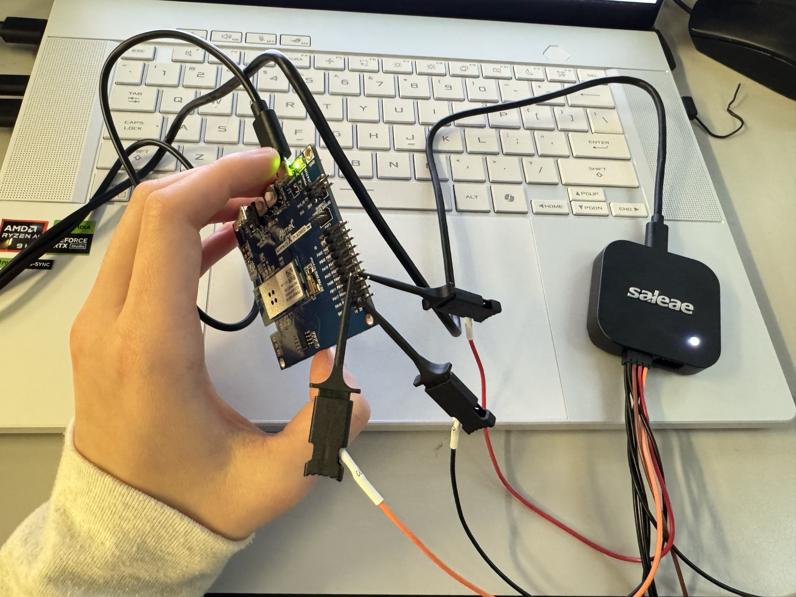
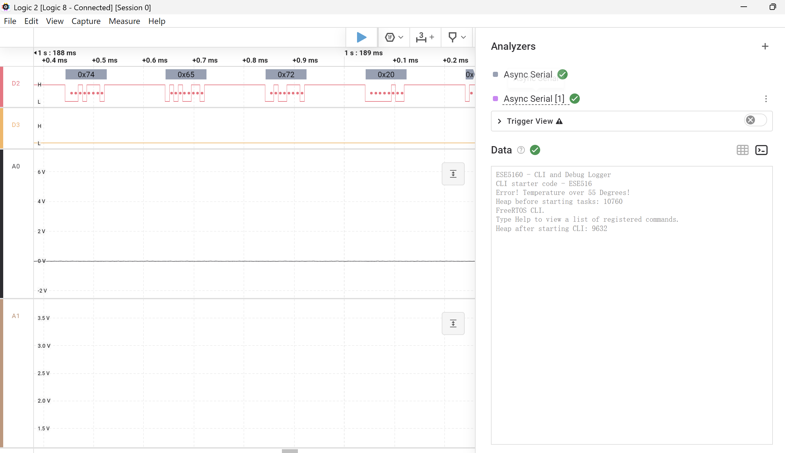

# a07g-exploring-the-CLI

* Team Number: 27
* Team Name: Pocket Pet
* Team Members: Kelly LAI, Yuyan WANG
* GitHub Repository URL: [final-project-a07g-a14g-t27-pocket-pet/A07G_README.md at main · ese5160/final-project-a07g-a14g-t27-pocket-pet](https://github.com/ese5160/final-project-a07g-a14g-t27-pocket-pet/blob/main/A07G_README.md)
* Description of test hardware: (development boards, sensors, actuators, laptop + OS, etc)

## **1. Software Architecture**

#### 1.1 Updated HRS & SRS

#### 1.2 Block diagram

#### 1.3 Flowcharts or state machine diagrams

## **2. Understanding the Starter Code**

* What does “InitializeSerialConsole()” do? In said function, what is “cbufRx” and “cbufTx”? What type of data structure is it?   Initializeseria1console() sets up the UART interface by initiallzing circular buffers cbufRx for received data and cbufTx for transmitted data, configuring the USART peripheral, registering callbacks, setting the interrupt priority, and starting an asynchronous read operataion. cbufRx and cbufTx are circular buffers, a fixed size data structure that efficiently manages streaming data using a head and tail pointer.
* How are “cbufRx” and “cbufTx” initialized? Where is the library that defines them (please list the *C file they come from).

  cbufRx and cbufTx are initialized in initializeserialconsole() using circular_buf_init(), which sets up circular buffers for receiving and transmitting UART data using rxCharacterBuffer and txCharacterBuffer, each 512 bytes in size. These bufers manage UART communication eficiently by storing incoming and outgoing charactes. The data type cbuf_handie_t and funcions ike circular_buf_init() and circular__buf_get() are likely defined in a separate C fle, circular_ buffer.c, with coresponding declaraions in a header file like circular_buffer.h.
* Where are the character arrays where the RX and TX characters are being stored at the end? Please mention their name and size.

  The received (RX) and transmitted (TX) characters are stored in the character arrays rxCharacterBufer (512 bytes) and txCharacterBuffer (512 bytes), respectively. These buffers temporarily hold UART data before being processed. While cbufRx and cbufTx are circular buffer structures, they internally manage data storage using rxCharacterBuffer and txCharacterBuffer.
* Where are the interrupts for UART character received and UART character sent defined?

  The UART character received and UART character sent interrupts are handled in the callback functions usart_read_callback() and  usart_write_callback(), respectively. These functions are registered using usart_register_callback() inside configure_usart_callbacks(), ensuring they are triggered when a character is received or transmited. 
* What are the callback functions that are called when:

A character is received? (RX) A character has been sent? (TX)

The callback function usart_read_callback() is tiggered when a character is received (RX), while usart_write_callback() is called when a character has been sent (TX). These callbacks are registered inside configure_usart_callbacks(), linking them to the USART interrupt system. This setup ensures effcient handling of UART communication by automatically responding to character transmission and reception events.

* Explain what is being done on each of these two callbacks and how they relate to the cbufRx and cbufTx buffers.

  In usart_read_callback(), when a character is received (RX), it is added to the cbufRx circular buffer, allowing the system to store incoming UART data efficiently, Similarly, in usart_ write_callback(), when a character has been sent (TX), the next character retrieved from cbufTx and transmited via usart_write_buffer_job(), ensuring continuous data transmission. These callbacks manage UART communication asynchronously by using cbufRx and cbufTx to buffer received and transmited characters, preventing data loss and reduang cpu overhead.
* Draw a diagram that explains the program flow for UART receive – starting with the user typing a character and ending with how that characters ends up in the circular buffer “cbufRx”. Please make reference to specific functions in the starter code.
* Draw a diagram that explains the program flow for the UART transmission – starting from a string added by the program to the circular buffer “cbufTx” and ending on characters being shown on the screen of a PC (On Teraterm, for example). Please make reference to specific functions in the starter code.
* What is done on the function “startStasks()” in main.c? How many threads are started?

  The function StartTasks() initializes system tasks and prints the available heap memory before and after task creation. It starts the Command Line Interface (CLl) task using xTaskCreate(vCommandConsoleTask, "CLI_TASK", CLI_TASK_SIZE, NULL, CLI_PRIORITY, &c1iTaskHandle). lf the task creation fails, an error message is printed. Based on the provided code, only one thread (CLI task) is explicitly started in this function.

## 3. Debug Logger Module 

See repo

## 4.**Wiretap the convo!**

**1. What nets must you attach the logic analyzer to? (Check how the firmware sets up the UART in SerialConsole.c!)**

Based on the starter code, RX is connected to PB11 of SAMW25, channel 3 of logic analyzer. TX is connected to PB10 of SAMW25, channel 2 of logic analyzer.

**2. Where on the circuit board can you attach / solder to?**

We can find **test pads** or **pin headers** for PB10 (TX) and PB11 (RX).

Debug Header: J200 or similar

Direct Pin Soldering: Last Resort

**3. What are critical settings for the logic analyzer?**

Baud Rate: 115200

Data Bits: 8

Parity: None

Stop Bits: 1

Inverted Signal: No

Triggering: "Start Capture on UART Activity" (Edge trigger on TX)

Connections:

Screenshot:

## **5. Complete the CLI**

See repo

## 6. **Add CLI commands**

Link: https://drive.google.com/file/d/15kJ_gmJ5qCeg52yM-sOtPaIdb8BneJOa/view?usp=sharing
