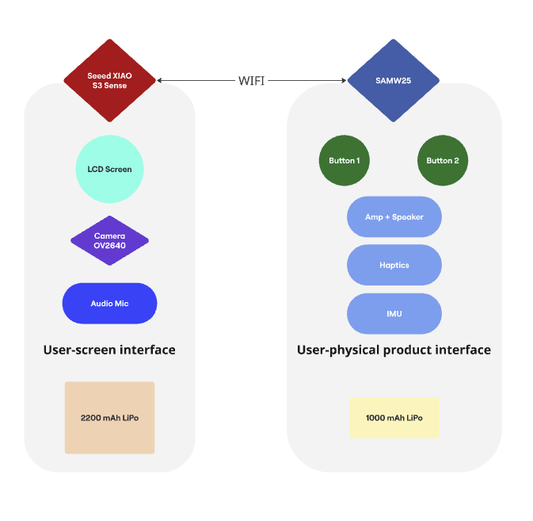

# a07g-exploring-the-CLI

* Team Number: 27
* Team Name: Pocket Pet
* Team Members: Kelly LAI, Yuyan WANG
* GitHub Repository URL: [final-project-a07g-a14g-t27-pocket-pet/A07G_README.md at main · ese5160/final-project-a07g-a14g-t27-pocket-pet](https://github.com/ese5160/final-project-a07g-a14g-t27-pocket-pet/blob/main/A07G_README.md)
* Description of test hardware: (development boards, sensors, actuators, laptop + OS, etc)

## **1. Software Architecture**

#### 1.1 Updated HRS & SRS

#### **1.1.1 Hardware Requirements Specification (HRS)**

**Overview**

The pocket-sized AI-based robotic cat is designed for  **companionship, entertainment, and productivity enhancement** . The hardware architecture consists of  **two microcontrollers** :

* **SAMW (Adafruit Audio FX Sound Board + 2x2W Amp)** : Handles  **audio output, haptic feedback, and button interactions** .
* **Seeed Studio XIAO ESP32 S3 Sense** : Manages  **screen animations, camera input, microphone processing, and Wi-Fi/BLE communication** .

The device also features a  **user-friendly design** , including:

* **NFC Chip at the Back** : Allows users to **tap their phone** to check the  **cat's birthday, ID, and unique digital profile** .
* **Circular Magnetic Ring** : Enables  **seamless switching between desktop mode and outdoor mode** . Users can also  **attach it to the back of an iPhone, turning it into a playful gadget** .

Each microcontroller is powered by a separate  **Li-Po battery** :

* **SAMW** :  **1000mAh Li-Po battery** .
* **Seeed XIAO ESP32 S3** :  **2200mAh Li-Po battery** .

**Functionality**

* **HRS 01** - The system shall use the **SAMW microcontroller** for  **audio playback, haptics, and button interactions** .
* **HRS 02** - The system shall use the **Seeed Studio XIAO ESP32 S3 Sense** for  **screen animations, camera input, and microphone processing** .
* **HRS 03** - The SAMW microcontroller shall utilize the **Adafruit Audio FX Sound Board** for  **storing and playing sound files** .
* **HRS 04** - The system shall include a **Mini Metal Speaker (8Ω, 0.5W)** for  **audio feedback** .
* **HRS 05** - The system shall include a **DC Motor Vibration ERM (Haptic) 10000 RPM 3VDC** for  **tactile feedback** .
* **HRS 06** - The system shall have **two press buttons** for user interaction, such as controlling sound effects or toggling modes.
* **HRS 07** - The Seeed Studio XIAO ESP32 S3 shall process **microphone input** for AI-based responses.
* **HRS 08** - The system shall feature a **Seeed Studio Round Display** for  **AI animations and status updates** .
* **HRS 09** - The system shall integrate an **OV2640 Camera Sensor** to capture  **photos for interactive experiences** .
* **HRS 10** - The system shall include an  **NFC chip at the back** , allowing users to  **tap their phone to check the cat's birthday, ID, and owner data** .
* **HRS 11** - The system shall support **Wi-Fi-based communication between the SAMW and Seeed XIAO ESP32 S3** for  **seamless coordination** .
* **HRS 12** - The system shall feature **Bluetooth 5.0 connectivity** for external control and data transfer.
* **HRS 13** - The device shall include a **circular magnetic ring** to allow users to:

  * **Switch between desktop and outdoor mode effortlessly** .
  * **Attach it to the back of an iPhone, turning it into an interactive gadget** .
* **HRS 14** - The SAMW microcontroller shall be powered by a  **1000mAh Li-Po battery** , while the Seeed Studio XIAO ESP32 S3 shall be powered by a  **2200mAh Li-Po battery** .
* **HRS 15** - The **SAMW microcontroller shall include an IMU (Inertial Measurement Unit)** to detect  **motion, orientation, and gestures** .
* **HRS 16** - The **IMU shall communicate via I2C/SPI** for real-time motion tracking.

#### **1.1.2 Requirements Specification (SRS)**

**Overview**

The robotic cat’s software is designed to create  **an intelligent, interactive, and user-friendly experience** . The  **two microcontrollers communicate over Wi-Fi** , ensuring **real-time synchronization** of:

* **Audio feedback & haptic responses (SAMW)** .
* **LCD animations, camera processing, and AI-based interactions (Seeed XIAO ESP32 S3)** .

Additionally, the software supports **NFC-based interactions and multi-mode magnetic positioning** for maximum usability.

**Users**

* **Primary User** : Individuals seeking a robotic companion or virtual pet.
* *Example Persona:* Amy Clark, a college student who enjoys having a digital pet in her pet-free apartment.
* **Secondary User** : Tech enthusiasts and developers exploring AI-driven robotics.
* *Example Persona:* Andrew Yang, an AI engineer interested in smart robotics.

**Definitions & Abbreviations**

* **AI** : Artificial Intelligence, enabling cloud-based and local AI interactions.
* **LCD** : Liquid Crystal Display for animations and status updates.
* **PWM** : Pulse Width Modulation for controlling motors and haptic feedback.
* **I2C** : Inter-Integrated Circuit, a communication protocol for hardware components.
* **SPI** : Serial Peripheral Interface for fast communication.
* **Wi-Fi** : Wireless network for microcontroller-to-microcontroller data transfer.
* **BLE 5.0** : Bluetooth Low Energy, enabling external device connectivity.
* **NFC** : Near Field Communication, used for  **checking ID, birthdays, and custom user data** .
* **Magnetic Ring Mode** : Allows  **switching between desktop, outdoor, and iPhone gadget mode** .

**Functionality**

|   **ID**   | **Function**      | **Description**                                                                       | **Requirement**                                                  | **Priority** |
| :--------------: | ----------------------- | ------------------------------------------------------------------------------------------- | ---------------------------------------------------------------------- | ------------------ |
| **SRS 01** | Wi-Fi Communication     | SAMW and Seeed XIAO ESP32 S3 shall communicate via Wi-Fi.                                   | **Data exchange latency shall not exceed 50ms.**                 | High               |
| **SRS 02** | LCD Display             | The LCD shall display**interactive animations, AI expressions, and status updates** . | **Response time for animations shall not exceed 100ms.**         | High               |
| **SRS 03** | Microphone Input        | The microphone shall capture**voice input**for AI-based interactions.                 | **Shall apply DSP-based noise filtering.**                       | High               |
| **SRS 04** | Camera Input            | The camera shall capture**images for user interaction** .                             | **Processing shall complete within 500ms per image.**            | Medium             |
| **SRS 05** | Haptic Feedback         | The vibration motor shall provide**tactile feedback**during user interactions.        | **Shall activate within 50ms.**                                  | Medium             |
| **SRS 06** | Sound Output            | The speaker shall output**AI-generated sounds and alerts** .                          | **Latency shall not exceed 50ms.**                               | High               |
| **SRS 07** | Button Input            | Buttons shall serve as**interaction triggers** .                                      | **Response time shall be within 50ms.**                          | High               |
| **SRS 08** | NFC ID Check            | The system shall provide**ID and birthday details via NFC** .                         | **Users shall tap their phone to access this data instantly.**   | High               |
| **SRS 09** | Magnetic Mode Switching | The system shall support**desktop, outdoor, and iPhone gadget mode** .                | **The user shall be able to switch modes seamlessly.**           | High               |
| **SRS 10** | BLE Connectivity        | The system shall support**Bluetooth for external control options** .                  | **BLE 5.0 shall be used for pairing.**                           | High               |
| **SRS 11** | Power Management        | The system shall optimize**power consumption**based on activity.                      | **Low-power mode shall activate when battery drops below 10%.**  | High               |
| **SRS 12** | Motion Tracking (IMU)   | The**IMU on SAMW**shall detect **tilt, rotation, and movement** .               | **Motion data shall be logged at 100Hz for smooth tracking.**    | Medium             |
| **SRS 13** | Gesture Recognition     | The**IMU shall enable gesture-based interactions**(e.g., **shake to wake** ).   | **The system shall recognize predefined gestures within 200ms.** | Medium             |

---

#### **1.1.3 Summary of User-Friendly Features**

| **Feature**            | **Benefit**                                                                             |
| ---------------------------- | --------------------------------------------------------------------------------------------- |
| **NFC-Based ID Check** | Users can tap their phone to**see the cat’s name, birthday, and digital profile** .    |
| **Magnetic Ring Mode** | Allows**seamless switching**between **desktop, outdoor, or iPhone gadget mode** . |
| **Compact & Portable** | The cat is**lightweight and attachable** , making it easy to carry anywhere.            |

#### 1.2 Block diagram

#### 1.3 Flowcharts or state machine diagrams

## **2. Understanding the Starter Code**

* What does “InitializeSerialConsole()” do? In said function, what is “cbufRx” and “cbufTx”? What type of data structure is it?
* How are “cbufRx” and “cbufTx” initialized? Where is the library that defines them (please list the *C file they come from).
* Where are the character arrays where the RX and TX characters are being stored at the end? Please mention their name and size.

Tip: Please note cBufRx and cBufTx are structures.

* Where are the interrupts for UART character received and UART character sent defined?
* What are the callback functions that are called when:

A character is received? (RX)

A character has been sent? (TX)

* Explain what is being done on each of these two callbacks and how they relate to the cbufRx and cbufTx buffers.
* Draw a diagram that explains the program flow for UART receive – starting with the user typing a character and ending with how that characters ends up in the circular buffer “cbufRx”. Please make reference to specific functions in the starter code.
* Draw a diagram that explains the program flow for the UART transmission – starting from a string added by the program to the circular buffer “cbufTx” and ending on characters being shown on the screen of a PC (On Teraterm, for example). Please make reference to specific functions in the starter code.
* What is done on the function “startStasks()” in main.c? How many threads are started?

| **SRS 12** | Motion Tracking (IMU) | The**IMU on SAMW**shall detect **tilt, rotation, and movement** . | **Motion data shall be logged at 100Hz for smooth tracking** . | Medium |
| ---------------- | --------------------- | ----------------------------------------------------------------------------- | -------------------------------------------------------------------- | ------ |

| **SRS 13** | Gesture Recognition | The**IMU shall enable gesture-based interactions**(e.g., **shake to wake** ). | **The system shall recognize predefined gestures within 200ms** . | Mediu |
| ---------------- | ------------------- | ----------------------------------------------------------------------------------------- | ----------------------------------------------------------------------- | ----- |
